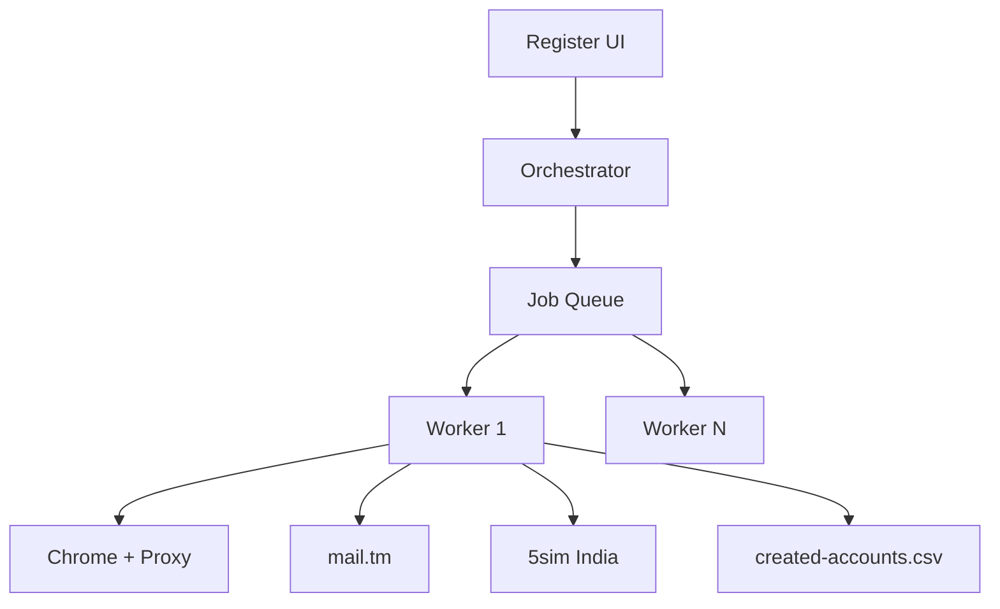
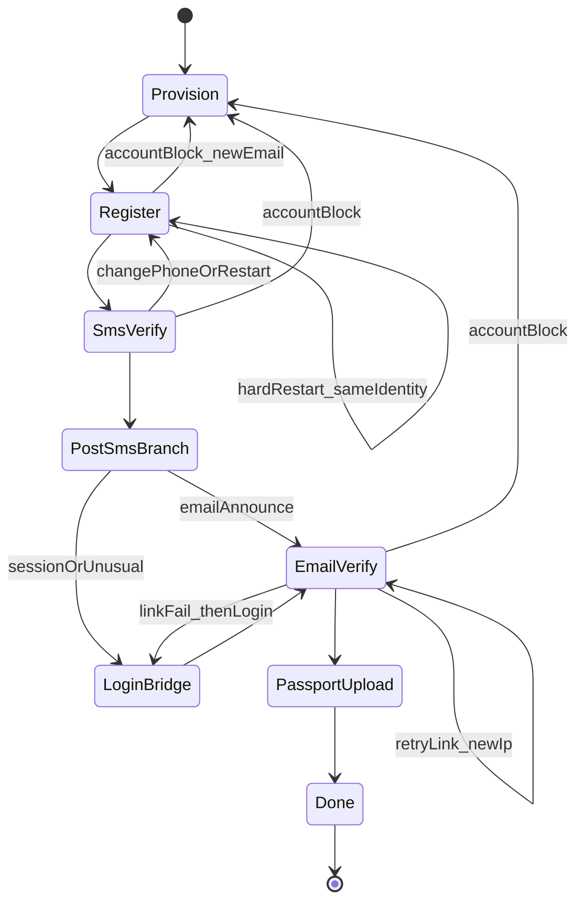

# VFS Account Register Bot — Full Plan & Algorithm

## Goal

Standalone automation that creates VFS accounts for selectable corridors (default `ind`/`lva`), using passport CSV + passport images, mail.tm inboxes, India SMS via **5sim**, and fixed password `123qwe!Q`. Outputs success rows to a CSV next to the input CSV. Does **not** write `instances-data.json` and does **not** run inside the main booking bot.

## Location & stack

New folder at repo root: [`register-bot/`](register-bot/)

```
register-bot/
  package.json          # own scripts; depends on playwright, dotenv, undici
  .env.example
  src/
    index.ts            # start UI server + orchestrator
    ui/
      server.ts         # local HTTP UI (same style as applicantDetailsFormServer)
      page.html / client.ts
    config.ts
    types.ts
    orchestrator.ts     # job queue + concurrency
    worker.ts           # one account end-to-end
    steps/
      registerForm.ts
      smsVerify.ts
      emailVerify.ts
      loginBridge.ts
      passportUpload.ts
    services/
      mailTm.ts         # create account + read activation link
      sms5sim.ts        # buy India number, poll OTP, cancel
      chrome.ts         # launch/kill/incognito profile per worker
      proxy.ts          # reuse PROXY_URLS rotation from main .env
      turnstile.ts      # copy/adapt from main bot
      pageGuards.ts     # session/unusual/black/account-block detectors
      cookies.ts        # Accept All Cookies
    io/
      csvPassports.ts
      passportImages.ts
      resultsCsv.ts
```

Reuse by **copy/adapt** (not import coupling) from:
- [`src/services/turnstile.click.ts`](src/services/turnstile.click.ts)
- [`src/services/mailTm.service.ts`](src/services/mailTm.service.ts) (extend with `POST /accounts` + link extract)
- [`src/utils/chromeProfileSessionClean.ts`](src/utils/chromeProfileSessionClean.ts), [`src/utils/chromeWindow.ts`](src/utils/chromeWindow.ts)
- Cookie dismiss already in [`src/services/browser.login.ts`](src/services/browser.login.ts) (`Accept All Cookies`)
- Block detectors in [`src/services/browser.service.ts`](src/services/browser.service.ts) / login WAF checks
- Proxy list via same `PROXY_URLS` / sticky session pattern as main [`src/config/config.ts`](src/config/config.ts)

## UI inputs

Local browser UI (like main setup form):

| Field | Default / behavior |
|-------|-------------------|
| Country / Mission | Selectable; builds `https://visa.vfsglobal.com/{country}/en/{mission}/register` and login URL |
| Email prefix | e.g. `7_30_ind_lva` → addresses `7_30_ind_lva_001` … `_NNN` |
| Account count | Integer N |
| Password | `123qwe!Q` (editable, used for mail.tm + VFS) |
| Passport CSV path | Upload or path picker |
| Passport folder | Path (e.g. `D:\...`); files `.jpg/.png/.pdf` sorted name ASC |
| Concurrent workers | Input number (e.g. 1–10) |
| 5sim API key | Required |
| Start / Stop | Controls |

**Pre-run validation (fail closed):**
- Parse CSV col1 only (ignore extra cols like `FEMALE`)
- List images with allowed extensions, sort ASC by filename
- If `csvRows.length !== imageCount` → **UI alert**, do **not** start
- Effective jobs = `min(accountCount, csvRows.length)` (count 100 + CSV 50 → 50; count 10 + CSV 50 → 10)
- Emails: `{prefix}_{001..jobs}` + `@` + first available mail.tm domain from `GET /domains`
- Require 5sim key + password non-empty

Live UI panel: per-job status (queued / register / sms / email / login / upload / done / failed), captcha attention banner, text alerts (no Telegram).

## Data binding per job index `i` (0-based)

- Email local: `{prefix}_{String(i+1).padStart(3,'0')}`
- Passport number: CSV row `i` col1
- Passport file: sorted images[`i`]
- Password: UI password
- Phone: purchased from 5sim at SMS step (India)
- Worker id: `reg-{i+1}` → Chrome user-data dir `register-bot/.profiles/reg-{i+1}` (isolated; launch with incognito-equivalent clean profile / `--incognito` + unique dir)

## Output

On each success, append to `{inputCsvDir}/created-accounts.csv` (create with header if missing):

```
email,password,phone,passport
```

Same folder as input CSV. Failures only in UI log (optional `failed-accounts.csv` later — not in v1).

---

## High-level architecture



Orchestrator runs up to `concurrent` workers. Each worker owns one Chrome+proxy sticky id, processes one job fully, then takes the next queued job (or exits when queue empty).

---

## Page / error detectors (`pageGuards`)

Poll page URL + body every ~1s (and before/after navigation):

| Signal | Detect | Action (context-dependent below) |
|--------|--------|----------------------------------|
| Session expired | URL `session-expired` or text `Session Expired or Invalid` | Hard restart |
| Unusual behavior | `Access Restricted Due to Unusual Activity` / `403201` | Hard restart |
| Account block | `Access Restricted for User ID` / `4290XX` | New identity restart |
| Black screen | After load, within **3s**: almost no DOM text (e.g. body text length &lt; ~40 and no register/login form) | Same as session/unusual |
| Page not found | URL contains `page-not-found` | Hard restart |
| Captcha | Turnstile present, auto-click fails | UI alert + focus Chrome; wait manual (reuse main bot wait) |
| Cookies | Banner with Accept All Cookies | Always click when seen |

**Hard restart** = kill Chrome → clear profile session → rotate proxy IP → new Chrome → resume from specified step.

---

## Full algorithm

### A. Bootstrap

1. User fills UI → Start.
2. Validate CSV ↔ images count; on mismatch → UI alert → abort start.
3. Build job list `[0 .. jobs-1]`.
4. Start `concurrent` worker loops; each pulls next job index.

### B. Worker: process one job



#### Step 0 — Provision identity

1. Create mail.tm account: `POST /accounts` `{ address: email@pickedDomain, password }`.
2. If address taken → UI alert, mark job failed (or bump suffix — v1: fail job).
3. Allocate Chrome profile dir + next proxy sticky for this worker.
4. Launch Chrome (clean/incognito profile), open register URL.

#### Step 1 — Register form

URL: `https://visa.vfsglobal.com/{country}/en/{mission}/register`

1. Wait for form or error page (max reasonable timeout).
2. If cookies banner → **Accept All Cookies**.
3. If session / unusual / black (3s) / page-not-found → hard restart → retry Step 1 (same email/passport; **new phone not yet bought**).
4. If account block → cancel any SMS order → new email (re-provision mail.tm with next unused suffix or mark need new prefix) + new IP → restart from Step 0.  
   *v1 rule for account block:* burn current email, create new mail.tm address `{prefix}_{idx}_r{retry}` or skip to next unused number outside range — **simpler: append `_r{n}` to local part**, new phone later, new IP.
5. Fill:
   - Email
   - Passport number
   - Password + Confirm password (`123qwe!Q`)
   - Dial code = India (`+91` / whatever the dropdown value is)
   - Local number = from 5sim (buy number **before** fill if phone required on this page — see note)
6. Check all **3** consent checkboxes (Privacy Notice, international transfer, Terms).
7. Solve Turnstile (auto → manual + UI alert).
8. Click **Continue**.
9. Expect SMS verify page. If land on session/unusual/black → hard restart Step 1. If account block → Step 0 new email+IP.

**Phone timing:** Buy 5sim India `other` (or listed VFS product if present) **just before** filling phone fields so the number is fresh. Keep `orderId` for poll/cancel.

#### Step 2 — SMS verify

1. Poll 5sim for SMS code up to **2 minutes**.
2. On code: enter OTP, Turnstile if any, submit.
3. **No SMS in 2 min:**
   - Click **change phone number** → back to register form.
   - Cancel old 5sim order; buy **new** India number.
   - Change phone only (keep email/passport/password); captcha; Continue.
   - Poll SMS again 2 min.
   - If still no SMS → hard restart from Step 1 with **new phone** (same email).
4. Before/during SMS page: session/unusual → hard restart Step 1 with **new phone + new IP**.
5. Account block → Step 0 with **new email + new phone + new IP**.
6. After successful SMS submit, branch on landing page:
   - **Email verify announce** text/page → go Step 3.
   - **Session / unusual / black / page-not-found** → Step 2b Login bridge (not email link yet).
   - **Account block** → Step 0 new identity.

#### Step 2b — Login bridge (post-SMS recovery)

1. New window + new IP → open login URL for same country/mission.
2. Cookies → Accept All; Turnstile; login with email + password.
3. Handle login OTP via mail.tm if shown (digit OTP) — same as main bot.
4. Expect activation / verify email to arrive (or already in inbox).
5. Continue to Step 3 (email link).

#### Step 3 — Email link verify

1. Poll mail.tm for message containing VFS activation/verify **URL** (new helper: extract `https://…` links; prefer vfsglobal verify/activate paths). Timeout configurable (e.g. 3–5 min).
2. Open link in current or new tab.
3. If before landing: session/unusual → open link again on **new window + new IP** (max **2** tries).
4. If still failing → login page new window + new IP (Step 2b style) then retry inbox link once more.
5. Account block → Step 0 new email + phone + IP.
6. Success = activation confirmed / redirected toward passport upload or post-login upload entry.

#### Step 4 — Passport upload

1. After login/activation success, land on passport upload page.
2. `setInputFiles` with job’s image/pdf.
3. Turnstile if present; click **Continue**.
4. If navigate to **dashboard** → UI text alert success (e.g. `Account ready: email / passport`) → append row to `created-accounts.csv` → Done.
5. Any upload/validation error → **UI alert** with message; mark job failed (do not loop forever unless session/unusual → hard restart upload once with new IP).

### C. Concurrency & resources

- `concurrent` workers; each has unique profile dir + CDP port offset + proxy sticky `reg-{workerSlot}`.
- Shared: job queue mutex, results CSV append lock, mail.tm domain cache, UI status bus.
- Stop button: set abort flag; workers finish current step cleanup (cancel 5sim order) then exit.

### D. Captcha policy

Everywhere Turnstile appears (register, SMS, login, upload): auto-click → on failure UI alert “Solve captcha on worker X” + bring window to front → wait until token or timeout → fail job or retry per step policy.

---

## 5sim client (single provider)

- Auth: API key from UI.
- Country: **India** only.
- Product: `other` (fallback if a `vfs` product exists, prefer it).
- Flow: get balance → buy number → return `{ phone, orderId, dialCode, localNumber }` → poll status until SMS or timeout → cancel/finish order.
- Parse E.164 / national: dial field `+91` (or dropdown), local = number without country code.

## mail.tm client extensions

- `pickDomain()` from `GET /domains`
- `createAccount(address, password)`
- `waitForActivationLink({ token, timeout, baselineIds })` — extract hrefs from text/html, filter vfsglobal
- Keep existing OTP digit extract for login-bridge OTP if needed

---

## Locked product decisions

- Password default `123qwe!Q` for mail.tm + VFS
- Email start index always `_001`
- CSV col1 only; images sorted ASC; counts must match or UI alert and no start
- Jobs = min(count, csv length)
- SMS: India via **5sim** only
- Alerts: UI only
- Output CSV beside input; no `instances-data.json`
- Register/login URLs selectable by country/mission
- Black screen = 3s almost-empty DOM → same as session/unusual
- Separate folder `register-bot/`; main bot booking cycle untouched

## Implementation order

1. Scaffold `register-bot/` + UI form + validation + results CSV writer
2. Chrome/proxy/cookies/pageGuards/Turnstile
3. mail.tm create + link extract; 5sim India client
4. Step 1 register form selectors (against live `ind/lva/register`)
5. Step 2 SMS + change-phone loop
6. Step 2b login bridge + Step 3 email link
7. Step 4 passport upload → dashboard success
8. Orchestrator concurrency + status UI polish

## Risk notes

- Register DOM selectors must be captured from live page (Angular `formcontrolname` likely).
- 5sim “other” delivery rate for VFS may be low — UI will surface SMS timeouts so you can switch keys/provider later by replacing `sms5sim.ts` only.
- mail.tm domains sometimes blocked by VFS — domain picker should retry next domain on create/register email rejection.
